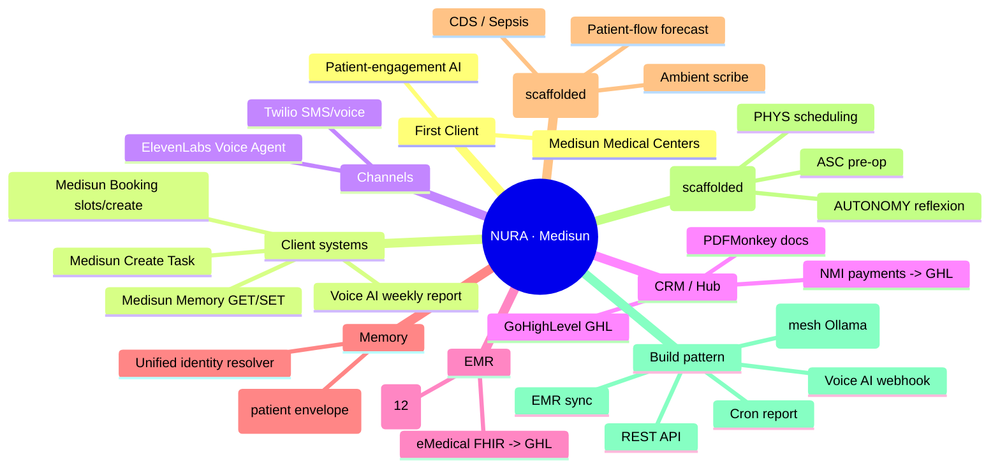

# Medisun Medical Centers — First Client (Integration & Flow Record)

**Client:** Medisun Medical Centers · **Product:** NURA patient-engagement AI (front-office automation) · **Date:** 2026-08-26
**Class:** First-client record · Source of truth (vault). Mirror: Notion client page.

---

## The integration map (56 n8n workflows, classified)
| Integration | Workflows | Role | Status |
|---|---|---|---|
| **Medisun** | Memory GET/SET (patient envelope) · Booking get-slots/create · Create Task · Voice AI weekly report · Kreyol page | The client's systems | 🟢 LIVE |
| **GoHighLevel (GHL)** | ElevenLabs→GHL booking · GHL→PDFMonkey · NMI→GHL · eMedical→GHL | CRM hub | 🟢 LIVE |
| **OpenEMR** | appointment reminders · claims/billing · FHIR search · insurance eligibility · lab release · post-visit follow-up · RCM exceptions · sec comms · self-scheduling | EMR (internal truth) | 🟡 SCAFFOLDED |
| **eMedical** | FHIR → GHL patient/appointment sync | 2nd EMR | 🟡 SCAFFOLDED |
| **ElevenLabs** | convAI appointment booking · pharmacy task · multi-clinic · voice test | Voice agent | 🟢 LIVE |
| **Twilio** | voice/SMS telephony | Channels | 🟢 LIVE |
| **Redis** | shared patient memory (Medisun GET/SET) | Memory | 🟢 LIVE |
| **NMI** | sale success → GHL contact | Payments | 🟢 LIVE |
| **PDFMonkey** | GHL → PDF documents | Docs | 🟢 LIVE |
| **Zapier** | Hermes bridge (CI/CD webhook) | Integration | 🟢 LIVE |
| **Google** | Drive · Sheets · video generation | Media/storage | 🟡 part |
| **CLIN** | ambient scribe · CDS · sepsis · patient-flow forecast | Clinical AI | 🟡 SCAFFOLDED |
| **ASC / PHYS / AUTONOMY** | pre-op clearance · scheduling+reminders · reflexion loop | Ops/AI | 🟡 SCAFFOLDED |
| **Labs** | provider-labs ingest · lab→OpenEMR/CRM condition tags | Labs | 🟢 LIVE (ingest) |

## How it flows (the data flow)
```
INBOUND
  Patient call/SMS → [Twilio] → [ElevenLabs Voice AI agent] (convAI conversation)
    → extract intent → [Medisun Memory GET] (envelope: phone/name/dob/insurance/meds)
    → [GoHighLevel] (CRM contact + workflow)
    → [Medisun Booking] (get slots → create appointment)
    → [OpenEMR] write-back (via eMedical FHIR sync / OpenEMR API)
    → [NMI] payment (sale → contact) → [PDFMonkey] documents

OUTBOUND (scheduled follow-up)
  Appointment reminder engine
    → [Twilio SMS] (day-before + hour-before, schedule-type prep)
    → [ElevenLabs voice call] (no-reply / confirm / reschedule)
    → patient reply → state machine → [Medisun Memory SET] write-back
    → [OpenEMR] status (no-show, reschedule, confirmed)

MEMORY
  [Redis] via Medisun Memory GET/SET — canonical key phone|email|patient_id, per-tenant prefix, append-only event log.
```

## How it's built (the pattern language)
- **Contract-first** (n8n-workflow-authoring): trigger → inputs/outputs → side effects → creds → failure/retry → activation gate.
- **4 recipe shapes:** REST API (`Webhook→Set→Code→httpRequest→respondToWebhook`) · Cron report (`scheduleTrigger→httpRequest→Code→Gmail`) · Voice AI (`ElevenLabs webhook→GHL→Memory GET/SET→branch per intent`) · EMR sync (`cron→httpRequest(FHIR)→itemLists→GoogleSheets→emailSend`).
- **Sovereign-LLM (free):** mesh Ollama `http://10.10.0.2:11434/v1` — `med42` (clinical) / `deepseek-r1` (general); use `httpRequest→/v1/chat/completions` (any OpenAI-compatible lane).
- **Error ladder (verified):** `lmChatOllama` = supply node (must feed `chainLlm`) · `chainLlm` 400s with no model sub-node · no `fetch` in Code nodes · `jsonBody` = `{{ JSON.stringify($json) }}` string · webhook-path conflicts block activation.

## Status
- 🟢 **LIVE:** Medisun front-office — Memory GET/SET, Booking, Create Task, ElevenLabs Voice AI, GHL sync, NMI→GHL, GHL→PDFMonkey, provider-labs ingest, weekly KPI.
- 🟡 **SCAFFOLDED (need LLM model wired + activation):** OpenEMR 8-pack (reminders/claims/eligibility/lab-release/post-visit/RCM/sec-comms/self-scheduling) · CLIN 4-pack (ambient scribe/CDS/sepsis/flow) · ASC pre-op · PHYS scheduling · AUTONOMY reflexion.

## Next (first-client build)
Wire the **appointment-reminder + no-show flow** (OpenEMR reminders → Medisun Memory envelope → Twilio SMS day-before/hour-before → ElevenLabs no-reply call → write-back), using the live Memory/Booking/voice primitives — governed by the `patient-appointment-followup` skill.

---

## Mind map (Mermaid — renders in GitHub/Obsidian)

